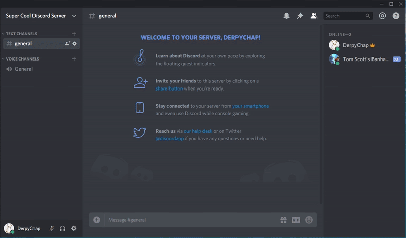

# Tom Scott's Discord Ban Hammer
A Discord bot that swings Tom Scott's banhammer on banned users. Made as part of the Discord Hack Week. [Here's Tom Scott's video that spawned this idea.](https://www.youtube.com/watch?v=nyD7FMwhwxc)



## Setup
**Python 3.6+ is required.**

The bot uses the Imgur Anonymous API for uploading the generated GIFs, so we'll need a client ID for Imgur's API. You can find documentation on how to create an application for Imgur [here](https://apidocs.imgur.com/?version=latest). Why is this? Well, the GIFs are like 1MB bigger than what Discord allows which is *quite* annoying.

Download the bot using either `git clone` or by downloading and extracting the ZIP, and then upen up a Terminal/PowerShell window and `cd` into the `banhammer-bot` folder. Then install the requirements listed in `requirements.txt`:

```
pip install -r requirements.txt
```

(If your OS comes with Python 2 preinstalled then replace `pip` with `pip3`)

Next, create a copy of `config.json.example`, rename it to `config.json` and open it up in your text editor of choice. Set `token` to be your Discord Bot token (create a bot in the [Developer Portal](https://discordapp.com/developers/applications/) if you haven't already) and set `client_id` to be your Imgur Client ID.

## Running
Invite your bot to your server using the following URL where `CLIENT_ID` is your Discord Application Client ID: `https://discordapp.com/oauth2/authorize?client_id=CLIENT_ID&scope=bot&permissions=0`

Once invited, make sure you have a System Channel set up as that's where the bot will post the GIFs, and make sure it has the following permissions for that channel:

 - Read Messages
 - Send Messages
 - Embed Links

Next, hop back to your Terminal/PowerShell window and run the bot using the following command:

```
python bot.py
```

(If your OS comes with Python 2 preinstalled then replace `python` with `python3`)

If all goes well then you should see a message telling you that it has connected. To test it, just ban some unfortunate soul from your server and, if all goes well, you should see a GIF of them being hit by Tom Scott's Banhammer. If something doesn't work then check its permissions and make sure your Imgur Client ID is set correctly. Failing that then open up an issue or holla@derpychap.co.uk.
